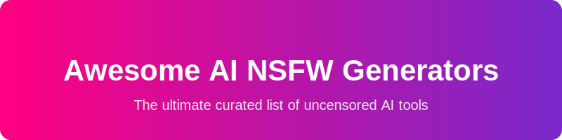

# Awesome-AI-NSFW-Generators

  
  

  

## Top AI NSFW Generators & Open-Source Alternatives (2026)

**Comprehensive Guide to Leading NSFW AI Tools** — Proprietary platforms vs. powerful open-source/local equivalents. Primary emphasis on **open-source** for privacy, unlimited use, and customization.

*Generated: July 2026* | 18+ Only | Use responsibly.

## 📑 Table of Contents
- [Overview](#overview)
- [Proprietary/Hosted Platforms](#proprietary-hosted-platforms)
- [Open-Source & Local Alternatives](#open-source--local-alternatives)
- [Comparison Table](#comparison-table)
- [Setup Guides & Resources](#setup-guides--resources)
- [Legal & Ethical Notes](#legal--ethical-notes)

## 🔍 Overview

> **Discover the ultimate curated list of the best AI NSFW generators, uncensored text-to-image tools, and open-source models for 2026.** Find tools like Candy AI, ComfyUI, Forge, and more for creating AI-generated adult content safely and privately.

NSFW AI generators create explicit images, videos, characters, and interactive content without mainstream filters. Proprietary services provide convenience and polished experiences, while **open-source tools** offer complete privacy (local execution), zero costs after setup, full customization, and no censorship.<grok-card data-id="3b21e4" data-type="citation_card" data-plain-type="" ></grok-card>

**2026 Trends**:
- Advanced photorealism, image-to-video, and face swapping.
- Local Stable Diffusion ecosystem (Forge, ComfyUI, etc.) dominates for serious creators.
- Models like Pony Diffusion V6 XL (stylized) and Juggernaut XL (realistic) lead NSFW.

## 🏢 Proprietary/Hosted Platforms/SaaS

### Candy AI
AI companion platform with chat, image/video generation, and voice interactions. Strong on personalized virtual girlfriends.<grok-card data-id="424eea" data-type="citation_card" data-plain-type="" ></grok-card>
- **Pricing**: Starts ~$5.99–$12.99/mo (annual discounts); tokens for extras.
- **Key Features**: Immersive storytelling, character customization.
- **Best For**: Emotional + visual companions.

### SoulGen
Character-focused NSFW image generator with chat capabilities. Balanced anime/photorealistic output.<grok-card data-id="9afad7" data-type="citation_card" data-plain-type="" ></grok-card>
- **Pricing**: ~$12.99/mo Pro; limited free tier.
- **Key Features**: High consistency, video support in newer versions.
- **Best For**: Custom character creation.

### Kupid AI
Competitive AI companion with strong personalization and voice.<grok-card data-id="18aa57" data-type="citation_card" data-plain-type="" ></grok-card>
- **Pricing**: Starts ~$9.99/mo.
- **Key Features**: Memory retention, interactive chats.

### Promptchan AI
Specializes in AI girlfriends, custom characters, images, and short videos. Excellent prompt control.<grok-card data-id="9c8194" data-type="citation_card" data-plain-type="" ></grok-card>
- **Pricing**: Freemium model.
- **Key Features**: Anime/hentai excellence, community vibes.
- **Best For**: Waifu-style creation.

### ZenCreator
Unrestricted NSFW image & video generator (text-to-video, image-to-video, face swap with hair, up to 4K). High privacy focus.<grok-card data-id="17682f" data-type="citation_card" data-plain-type="" ></grok-card>
- **Pricing**: ~$19.99/mo starter.
- **Key Features**: 100% NSFW pass rate, fast generation.
- **Best For**: Professional adult content.

### WildOwl.ai
Top unrestricted platform for images, video, editing, and permissive workflows.<grok-card data-id="2860c8" data-type="citation_card" data-plain-type="" ></grok-card>
- **Pricing**: Pay-as-you-go.
- **Key Features**: Leading models, creator-friendly.
- **Best For**: Flexible creative workflows.

### Seduced AI
High customization for detailed adult imagery and animations.<grok-card data-id="b95ec0" data-type="citation_card" data-plain-type="" ></grok-card>
- **Pricing**: Starts ~$25/mo.
- **Key Features**: Body/expression fine-tuning.

### RawNSFW Pro & Nakedly AI
Specialized uncensored tools focused on raw, explicit nude/adult generation.

**Others**: OurDream.AI, etc.

## 💻 Open-Source & Local Alternatives (Primary Emphasis)
Run **entirely on your hardware** — full privacy, unlimited generations, highly customizable via models/LoRAs from Civitai. No subscriptions, no filters.<grok-card data-id="e6fdc3" data-type="citation_card" data-plain-type="" ></grok-card>

### Automatic1111 Stable Diffusion WebUI (Forge fork recommended)
Most popular and versatile UI.<grok-card data-id="eb8ca6" data-type="citation_card" data-plain-type="" ></grok-card>
- **Key Features**: txt2img, img2img, inpainting, ControlNet, massive extension ecosystem.
- **Strengths**: Huge NSFW community/models; easy to extend.
- **GitHub**: lllyasviel/stable-diffusion-webui-forge

### ComfyUI
Node-based powerhouse for custom workflows and latest models (Flux support).<grok-card data-id="f4a9bb" data-type="citation_card" data-plain-type="" ></grok-card>
- **Key Features**: Advanced pipelines, batch processing, video tools.
- **Strengths**: Maximum control; bleeding-edge.
- **Best For**: Power users.

### Fooocus / RuinedFooocus
Simplest Midjourney-style interface. RuinedFooocus ships NSFW-ready with no safety filter.<grok-card data-id="d5bb67" data-type="citation_card" data-plain-type="" ></grok-card>
- **Key Features**: One-click generation, great for beginners.
- **GitHub**: runew0lf/RuinedFooocus

### Other Notable Open-Source Tools
- **InvokeAI**: Clean, organized interface.
- **SwarmUI / Pinokio**: Simplified installers.
- **Key Models** (Civitai):
  - Pony Diffusion V6 XL — Best for anime/stylized NSFW.
  - Juggernaut XL / RealVisXL — Photorealistic.
  - Flux variants — High quality local uncensored.

**Local Video**: Use AnimateDiff, ComfyUI workflows, or similar for NSFW animations.

**Pros**: Complete ownership, offline, modifiable, cost-free after hardware.
**Cons**: Needs GPU (6–12GB+ VRAM ideal); initial setup time.

## 📊 Comparison Table

| Tool                  | Type       | Pricing | Company Size              | Free Tier Limit | Image Quality | Video      | Privacy    | Ease of Use | Best For                     |
|-----------------------|------------|----------------------|--------------|-----------------|---------------|------------|------------|-------------|------------------------------|
| Candy AI             | Hosted    | $6–13+/mo           | $20M | Not specified   | High         | Yes       | Good      | Very High  | Companions                  |
| SoulGen              | Hosted    | $13+/mo             | $15M | Limited         | High         | Limited   | Good      | High       | Characters                  |
| Seduced AI           | Hosted    | ~$25/mo             | $10M | Not specified   | High         | Limited   | High      | High       | Body fine-tuning            |
| Kupid AI             | Hosted    | ~$9.99/mo           | $8M | Not specified   | High         | N/A       | Good      | High       | Interactive chats           |
| Promptchan AI        | Hosted    | Freemium            | $5M | Freemium        | Excellent    | Yes       | Good      | High       | Anime/Girlfriends           |
| ZenCreator           | Hosted    | ~$20+/mo            | $2M | Not specified   | Top          | Strong    | High      | High       | Video + Pro Images          |
| WildOwl.ai           | Hosted    | Pay-as-you-go       | $1M | Not specified   | Top          | Strong    | High      | High       | Flexible Creation           |
| **ComfyUI**  | **Local** | **Free**            | N/A | **N/A**         | **Excellent**| Strong    | **Full**  | Medium     | **Advanced/Custom**         |
| **Forge (A1111)**  | **Local** | **Free**            | N/A | **N/A**         | **Excellent**| Extensions| **Full**  | Medium-High| **Versatile Daily Driver** |
| **RuinedFooocus**  | **Local** | **Free**            | N/A | **N/A**         | High         | Limited   | **Full**  | **Very High** | **Quick & Simple**       |
## 🛠️ Setup Guides & Resources
1. **Hardware**: NVIDIA GPU recommended (RTX 3060+).
2. **Models**: [Civitai.com](https://civitai.com) — Search NSFW/Pony/Juggernaut.
3. **Install**:
   - Forge: Git clone repo → Run webui.
   - ComfyUI: Official GitHub + manager.
   - Pinokio: One-click browser installer for many tools.
4. **Prompt Tips**: Detailed positive/negative prompts + LoRAs for consistency.

## ⚖️ Legal & Ethical Notes
- All content must involve consenting adults (18+).
- Respect laws in your jurisdiction regarding generated material.
- Open-source tools are ideal for private, personal use.

---

**Contributions welcome!** Fork this README or suggest additions. Stay creative and responsible.

##  Star History

<a href="https://www.star-history.com/?repos=ishandutta2007%2FAwesome-AI-NSFW-Generators&type=date&legend=bottom-right">
<picture>
<source media="(prefers-color-scheme: dark)" srcset="https://api.star-history.com/chart?repos=ishandutta2007/Awesome-AI-NSFW-Generators&type=date&theme=dark&legend=bottom-right" />
<source media="(prefers-color-scheme: light)" srcset="https://api.star-history.com/chart?repos=ishandutta2007/Awesome-AI-NSFW-Generators&type=date&legend=bottom-right" />

</picture>
</a>

